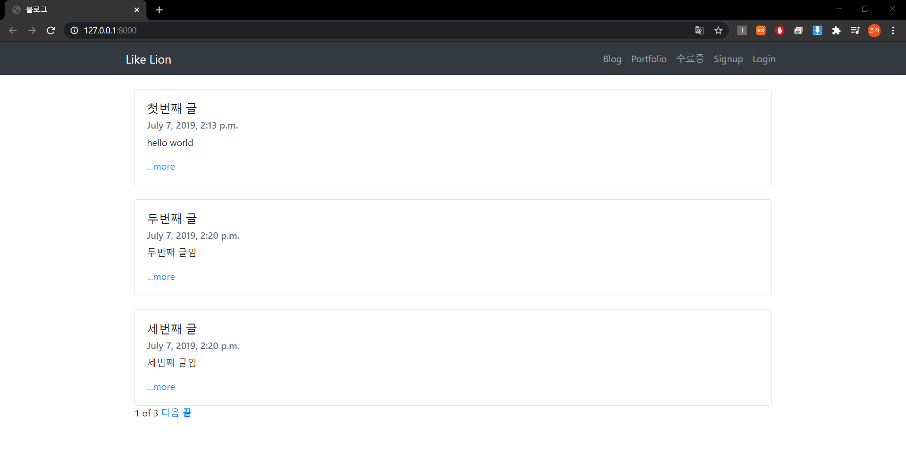
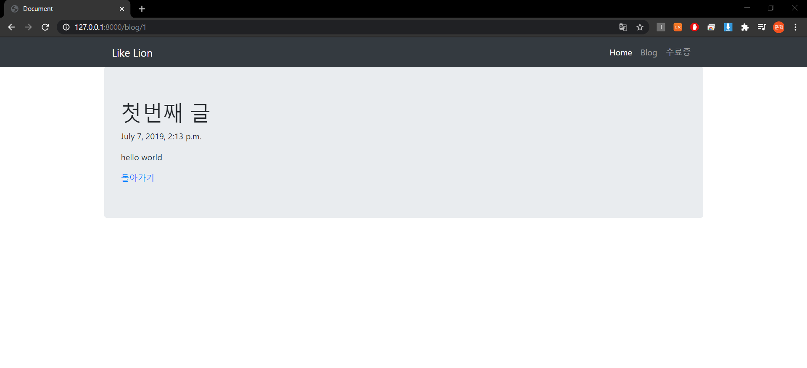
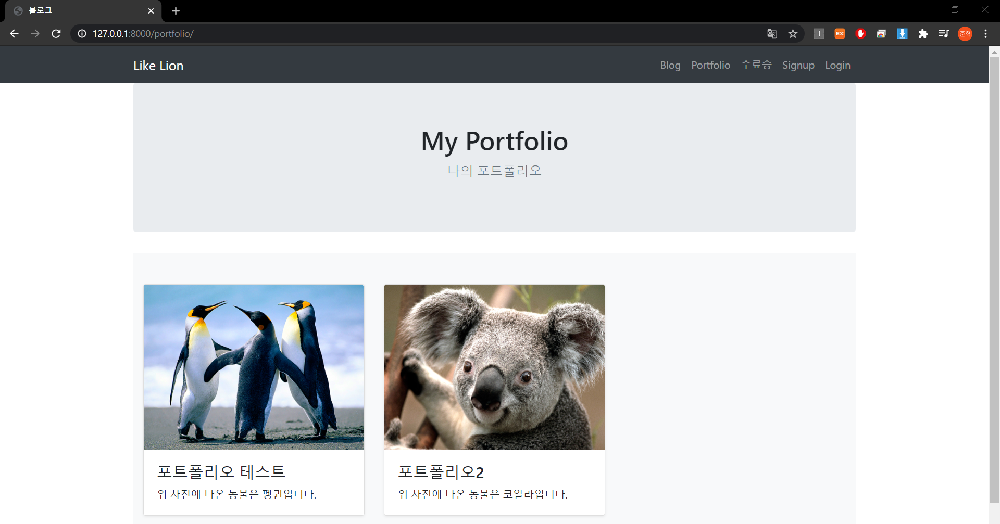

# myBlog
> 학부생 3학년 1학기 때 개발한 나의 블로그

## Installation

-

## Usage example

장고 프레임워크를 사용하여 블로그 및 포트폴리오 웹 구현

## Development setup

Framework: Django 2.2.14

## Release History

* 1.0.0
    * fifth commit
    * 개발 완료
    
* 0.4.0
    * fourth commit
    * 포트폴리오 기능 구현

* 0.3.0
    * third commit
    * 블로그 기능 구현

* 0.2.0
    * second commit of myBlog
    * 홈 페이지 구현

* 0.1.0
    * commit of myBlog
    * 프론트엔드 구현

## Meta

김준혁 – wnsgur1198@naver.com

## Contributing

1. Fork it (<https://github.com/yourname/yourproject/fork>)
2. Create your feature branch (`git checkout -b feature/fooBar`)
3. Commit your changes (`git commit -am 'Add some fooBar'`)
4. Push to the branch (`git push origin feature/fooBar`)
5. Create a new Pull Request

<!-- Markdown link & img dfn's -->
